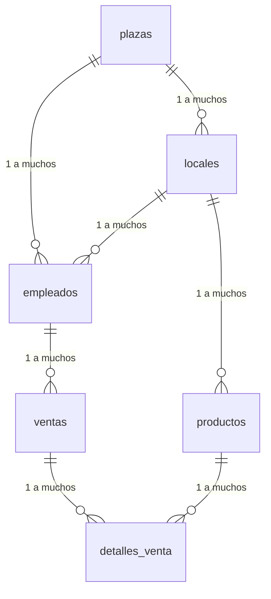

# Análisis de la Base de Datos - FoodPlaza

## Índice
1. [Estructura de la Base de Datos](#estructura-de-la-base-de-datos)
2. [Relaciones entre Tablas](#relaciones-entre-tablas)
3. [Modelo de Entidad-Relación](#modelo-entidad-relación)
4. [Estructura de la Aplicación](#estructura-de-la-aplicación)
5. [Endpoints Propuestos](#endpoints-propuestos)
6. [Consideraciones Técnicas](#consideraciones-técnicas)

## Estructura de la Base de Datos

### 1. Tabla `plazas`
- **Descripción**: Almacena información de las plazas comerciales
- **Campos principales**:
  - `id` (PK)
  - `nombre`
  - `direccion`
  - `estado` (activo/inactivo)

### 2. Tabla `locales`
- **Descripción**: Almacena información de los locales dentro de las plazas
- **Campos principales**:
  - `id` (PK)
  - `id_plaza` (FK a plazas)
  - `id_tipo_comercio` (FK a tipos_comercio)
  - `id_gerente` (FK a usuarios)
  - `nombre`
  - `direccion`
  - `descripcion`
  - `horario_apertura`
  - `horario_cierre`
  - `estado` (activo/inactivo)
  - `fecha_registro`

### 3. Tabla `empleados`
- **Descripción**: Registra la información de los empleados
- **Campos principales**:
  - `id` (PK)
  - `id_plaza` (FK a plazas)
  - `id_local` (FK a locales, opcional)
  - `nombre`
  - `puesto`
  - `estado` (activo/inactivo)

### 4. Tabla `productos`
- **Descripción**: Catálogo de productos disponibles
- **Campos principales**:
  - `id` (PK)
  - `id_local` (FK a locales)
  - `nombre`
  - `precio`
  - `existencia`
  - `estado` (activo/inactivo)

### 5. Tabla `ventas`
- **Descripción**: Registro de ventas realizadas
- **Campos principales**:
  - `id` (PK)
  - `id_empleado` (FK a empleados)
  - `fecha`
  - `total`
  - `estado`

### 6. Tabla `detalles_venta`
- **Descripción**: Detalle de productos en cada venta
- **Campos principales**:
  - `id` (PK)
  - `id_venta` (FK a ventas)
  - `id_producto` (FK a productos)
  - `cantidad`
  - `precio_unitario`
  - `subtotal`

## Relaciones entre Tablas



## Modelo Entidad-Relación

### Entidad Plaza
- Relación uno a muchos con Locales
- Relación uno a muchos con Empleados

### Entidad Local
- Relación muchos a uno con Plaza
- Relación uno a muchos con Empleados
- Relación uno a muchos con Productos

### Entidad Empleado
- Relación muchos a uno con Plaza
- Relación muchos a uno con Local (opcional)
- Relación uno a muchos con Ventas

### Entidad Producto
- Relación muchos a uno con Local
- Relación uno a muchos con DetallesVenta

### Entidad Venta
- Relación muchos a uno con Empleado
- Relación uno a muchos con DetallesVenta

### Entidad DetalleVenta
- Relación muchos a uno con Venta
- Relación muchos a uno con Producto

## Estructura de la Aplicación

```
src/main/java/asedi/foodplaza/
├── config/                 # Configuraciones
├── controlador/            # Controladores REST
│   ├── PlazaControlador.java
│   ├── LocalControlador.java
│   ├── EmpleadoControlador.java
│   ├── ProductoControlador.java
│   ├── VentaControlador.java
│   └── DetalleVentaControlador.java
├── modelo/                 # Entidades JPA
│   ├── Plaza.java
│   ├── Local.java
│   ├── Empleado.java
│   ├── Producto.java
│   ├── Venta.java
│   └── DetalleVenta.java
├── repositorio/            # Repositorios JPA
│   ├── PlazaRepository.java
│   ├── LocalRepository.java
│   ├── EmpleadoRepository.java
│   ├── ProductoRepository.java
│   ├── VentaRepository.java
│   └── DetalleVentaRepository.java
├── servicio/               # Lógica de negocio
│   ├── IPlazaServicio.java
│   ├── PlazaServicioImpl.java
│   ├── ILocalServicio.java
│   ├── LocalServicioImpl.java
│   └── ...
└── dto/                    # Objetos de Transferencia de Datos
    ├── PlazaDTO.java
    ├── LocalDTO.java
    └── ...
```

## Endpoints Propuestos

### Plazas
- `GET /api/plazas` - Listar todas las plazas
- `GET /api/plazas/{id}` - Obtener plaza por ID
- `POST /api/plazas` - Crear nueva plaza
- `PUT /api/plazas/{id}` - Actualizar plaza
- `DELETE /api/plazas/{id}` - Eliminar plaza (cambiar estado)

### Locales
- `GET /api/locales` - Listar todos los locales (retorna List<LocalDTO>)
- `GET /api/plazas/{idPlaza}/locales` - Listar locales por plaza (retorna List<LocalDTO>)
- `GET /api/locales/estado/{estado}` - Listar locales por estado (activo/inactivo)
- `GET /api/usuarios/{idGerente}/locales` - Listar locales por gerente
- `GET /api/tipos-comercio/{idTipo}/locales` - Listar locales por tipo de comercio
- `POST /api/locales` - Crear nuevo local (acepta LocalDTO)
- `GET /api/locales/{id}` - Obtener local por ID (retorna LocalDTO)
- `PUT /api/locales/{id}` - Actualizar local (acepta LocalDTO)
- `PATCH /api/locales/{id}/estado` - Cambiar estado del local
- `DELETE /api/locales/{id}` - Eliminación lógica (cambia estado a inactivo)


### Productos
- `GET /api/productos` - Listar todos los productos
- `GET /api/locales/{idLocal}/productos` - Listar productos por local
- `POST /api/productos` - Crear nuevo producto
- `PUT /api/productos/{id}` - Actualizar producto
- `PATCH /api/productos/{id}/existencia` - Actualizar existencia

### Ventas
- `POST /api/ventas` - Crear nueva venta (con detalles)
- `GET /api/ventas` - Listar ventas (con filtros opcionales)
- `GET /api/ventas/{id}` - Obtener venta por ID con detalles
- `GET /api/empleados/{idEmpleado}/ventas` - Ventas por empleado

## Consideraciones Técnicas

### Validaciones Necesarias
- Validación de estados (activo/inactivo)
- Validación de fechas y horarios (apertura debe ser antes de cierre)
- Validación de precios y cantidades positivas
- Validación de existencias antes de una venta
- Validación de claves foráneas (plaza, tipo_comercio, gerente)
- Validación de unicidad de nombre de local por plaza
- Validación de horarios de apertura/cierre
- Validación de formato de campos obligatorios

### Transacciones
- Operaciones que requieren transacciones:
  - Creación de una venta con sus detalles
  - Actualización de existencias de productos
  - Cambios de estado que afectan a múltiples entidades

### Seguridad
- Autenticación y autorización
- Roles de usuario (administrador, gerente, empleado)
- Validación de permisos por endpoint

### Optimizaciones Futuras
- Paginación para listados grandes
- Filtros avanzados
- Proyecciones para consultas específicas
- Caché para datos estáticos
- Documentación con Swagger/OpenAPI

### Manejo de Errores
- Excepciones personalizadas
- Mensajes de error claros
- Códigos de estado HTTP apropiados
