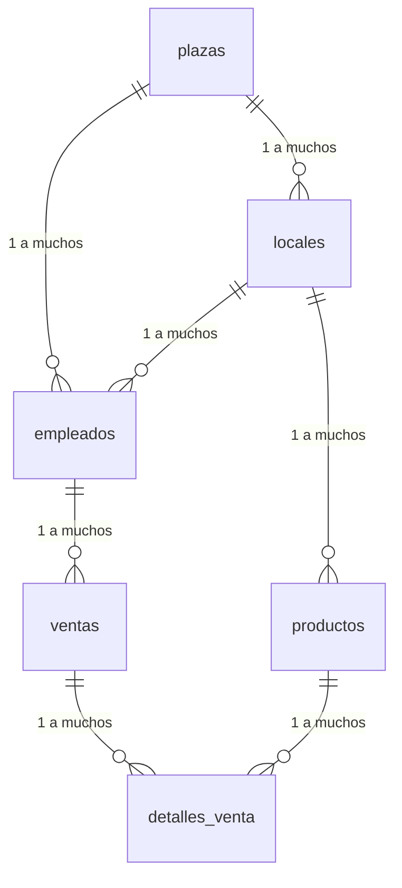

# FoodPlaza API

API para la gestión de plazas de comida, desarrollada con FastAPI.

## Características

-   **Autenticación y autorización:** Sistema de autenticación basado en tokens JWT para proteger los endpoints.
-   **Gestión de usuarios:** Creación, lectura, actualización y eliminación de usuarios con diferentes roles.
-   **Gestión de plazas:** CRUD completo para las plazas de comida.
-   **Gestión de locales:** CRUD completo para los locales dentro de las plazas.
-   **Gestión de menús:** CRUD completo para los menús de los locales.
-   **Gestión de productos:** CRUD completo para los productos de los menús.
-   **Gestión de imágenes:** Subida y gestión de imágenes para plazas, locales y productos.
-   **Documentación de la API:** Documentación interactiva generada automáticamente con Swagger y ReDoc.

## Tecnologías Utilizadas

-   **Backend:**
    -   [FastAPI](https://fastapi.tiangolo.com/): Framework web de alto rendimiento para construir APIs con Python.
    -   [SQLAlchemy](https://www.sqlalchemy.org/): ORM para interactuar con la base de datos.
    -   [Pydantic](https://docs.pydantic.dev/): Librería para validación de datos.
    -   [Uvicorn](https://www.uvicorn.org/): Servidor ASGI para ejecutar la aplicación.
    -   [Python-JOSE](https://python-jose.readthedocs.io/): Implementación de JWT para la autenticación.
    -   [Passlib](https://passlib.readthedocs.io/): Librería para el hashing de contraseñas.
-   **Base de datos:**
    -   MySQL (a través de `pymysql`)

## Estructura del Proyecto

```
/home/poncho/Documents/Workspace/foodplaza-fastApi/
├───app/
│   ├───core/             # Configuraciones, excepciones y seguridad
│   ├───crud/             # Lógica de negocio (CRUD)
│   ├───db.py             # Configuración de la base de datos
│   ├───dependencies.py   # Dependencias de la aplicación
│   ├───main.py           # Punto de entrada de la aplicación
│   ├───models/           # Modelos de la base de datos (SQLAlchemy)
│   ├───routers/          # Endpoints de la API
│   ├───schemas/          # Esquemas de datos (Pydantic)
│   └───services/         # Servicios externos (ej. Cloudinary)
├───docs/                 # Documentación del proyecto
├───.env.template         # Plantilla para las variables de entorno
├───requirements.txt      # Dependencias de Python
└───README.md             # Este archivo
```

## Endpoints de la API

La API está documentada utilizando OpenAPI (Swagger). Una vez que la aplicación esté en funcionamiento, puedes acceder a la documentación interactiva en las siguientes URLs:

-   **Swagger UI:** `http://localhost:8000/api/v1/docs`
-   **ReDoc:** `http://localhost:8000/api/v1/redoc`

Los principales endpoints de la API son:

-   `/api/v1/auth`: Autenticación y obtención de tokens.
-   `/api/v1/usuarios`: Gestión de usuarios.
-   `/api/v1/plazas`: Gestión de plazas.
-   `/api/v1/locales`: Gestión de locales.
-   `/api/v1/menus`: Gestión de menús.
-   `/api/v1/productos`: Gestión de productos.
-   `/api/v1/imagenes`: Gestión de imágenes.

## Cómo Empezar

### Prerrequisitos

-   Python 3.9+
-   MySQL

### Instalación

1.  **Clona el repositorio:**

    ```bash
    git clone https://github.com/tu-usuario/foodplaza-fastapi.git
    cd foodplaza-fastapi
    ```

2.  **Crea y activa un entorno virtual:**

    ```bash
    python -m venv .venv
    source .venv/bin/activate
    ```

3.  **Instala las dependencias:**

    ```bash
    pip install -r requirements.txt
    ```

4.  **Configura las variables de entorno:**

    Crea un archivo `.env` a partir del archivo `.env.template` y completa los valores correspondientes a tu base de datos y otras configuraciones.

    ```bash
    cp .env.template .env
    ```

### Ejecución

Para iniciar la aplicación, ejecuta el siguiente comando:

```bash
uvicorn app.main:app --reload
```

La aplicación estará disponible en `http://localhost:8000`.

## Base de Datos

El siguiente diagrama muestra la relación entre las principales tablas de la base de datos:



## Variables de Entorno

Las siguientes variables de entorno son necesarias para configurar la aplicación. Debes definirlas en un archivo `.env` en la raíz del proyecto.

-   `PROJECT_NAME`: Nombre del proyecto.
-   `VERSION`: Versión de la API.
-   `API_V1_STR`: Prefijo para la versión 1 de la API.
-   `ENV`: Entorno de la aplicación (ej. `development`, `production`).
-   `DATABASE_URL`: URL de conexión a la base de datos.
-   `SECRET_KEY`: Clave secreta para la firma de tokens JWT.
-   `ACCESS_TOKEN_EXPIRE_MINUTES`: Tiempo de expiración del token de acceso en minutos.
-   `BACKEND_CORS_ORIGINS`: Orígenes CORS permitidos.
-   `UPLOAD_DIR`: Directorio para la subida de archivos.